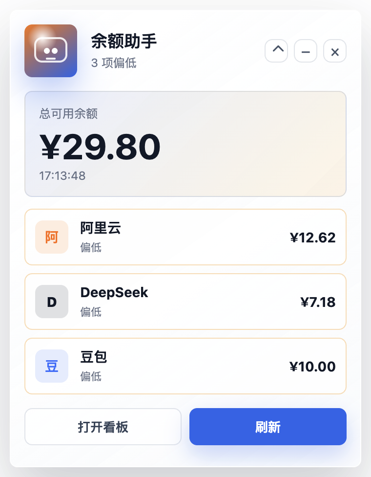
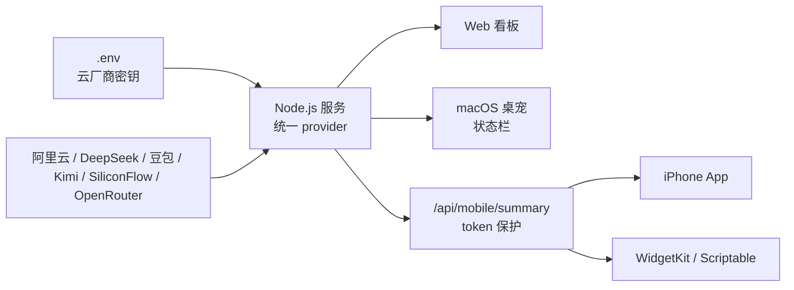
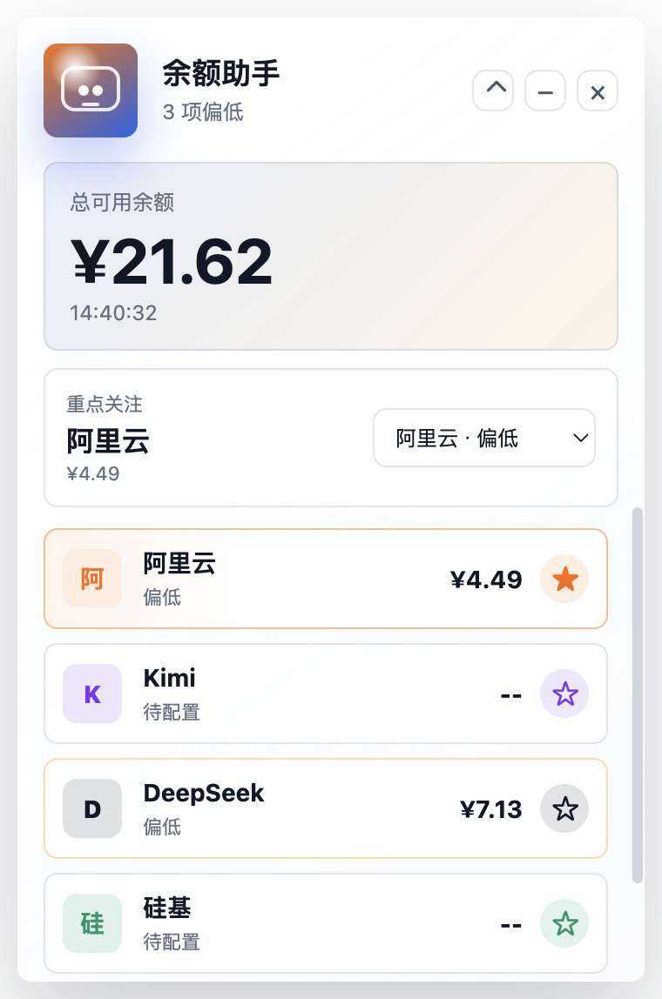
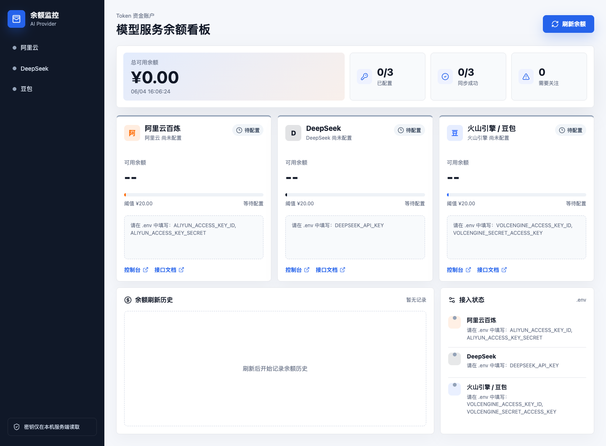
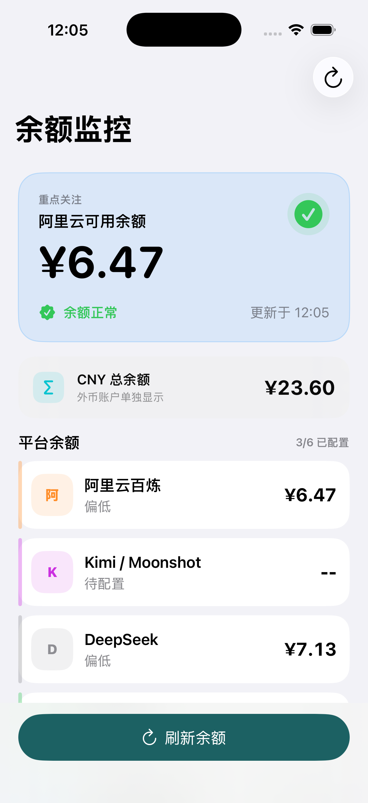

<p align="center">
  
</p>

<h1 align="center">Token 余额监控</h1>

<p align="center">
  一个轻量的 AI 模型账户余额监控工具，支持 Web 看板、macOS 状态栏桌宠、iPhone App 和 WidgetKit 小组件。
</p>

<p align="center">
  <a href="LICENSE"></a>
  
  
  
</p>

## 适用场景

如果你同时使用多个模型平台，可以用它把余额放到一个地方查看，减少反复打开控制台的次数。

- **日常查看**：在 macOS 状态栏显示总额或重点关注平台余额。
- **低额提醒**：iPhone 侧可以设置更低的提醒阈值，例如低于 2 元时提醒充值。
- **本地优先**：云厂商 AccessKey 只在本机或自托管服务器 `.env` 中读取，不打包到浏览器前端或 iOS 客户端。
- **方便扩展**：Web、桌宠、iOS App 共用同一套 provider，新增平台只需要补一个 fetcher。

## 数据流



## 预览

| macOS 桌宠 | Web 看板 | iPhone App / Widget |
| --- | --- | --- |
|  |  |  |

## 支持平台

| 平台 | 接入方式 | 汇总方式 |
| --- | --- | --- |
| 阿里云百炼 / 费用中心 | RAM AccessKey + 费用中心 API | CNY |
| DeepSeek | API Key + `/user/balance` | 按返回币种显示 |
| 火山引擎 / 豆包 | AccessKey + 费用中心 API | CNY |
| Kimi / Moonshot | API Key + 余额 API | CNY |
| SiliconFlow / 硅基流动 | API Key + 用户信息 API | CNY |
| OpenRouter | Management key + credits API | USD 单独显示 |

`totalCny` 只汇总人民币余额。OpenRouter 这类 USD credits 会单独显示，不会混入人民币总额。

OpenAI / Anthropic / Gemini 更适合做“本月成本 / 用量报表”，不是简单余额接口。相关状态见 [provider matrix](docs/provider-matrix.md)。

## 快速开始

### 1. 安装依赖

```bash
git clone https://github.com/pan609/token-balance-monitor.git
cd token-balance-monitor

cp .env.example .env
./scripts/install-deps.sh
```

### 2. 填写配置

打开 `.env`，按需填写平台 key。只想先看界面也可以留空，页面会显示“待配置”。

```bash
LOW_BALANCE_THRESHOLD_CNY=20
PRIMARY_PROVIDER_ID=aliyun
HOST=127.0.0.1
MOBILE_API_TOKEN=
MOBILE_API_URL=http://127.0.0.1:5173/api/mobile/summary
MOBILE_ALERT_THRESHOLD_CNY=2

DEEPSEEK_API_KEY=
MOONSHOT_API_KEY=
SILICONFLOW_API_KEY=
OPENROUTER_API_KEY=

ALIYUN_ACCESS_KEY_ID=
ALIYUN_ACCESS_KEY_SECRET=
VOLCENGINE_ACCESS_KEY_ID=
VOLCENGINE_SECRET_ACCESS_KEY=
VOLCENGINE_REGION=cn-beijing
```

### 3. 选择入口

| 场景 | 命令 |
| --- | --- |
| Web 看板 | `./start.command` |
| macOS 桌宠 / 状态栏 | `./pet.command` |
| iOS 模拟器 | `./scripts/run-ios-simulator.sh` |
| iPhone 真机 | `./scripts/run-ios-device.sh` |

没有全局 `npm` 也没关系，项目脚本会优先使用本地和 Codex bundled Node runtime。

## macOS 桌宠

双击 `pet.command` 会打开一个置顶小窗，并在 macOS 状态栏显示余额。

- 默认每 1 分钟自动刷新。
- 状态栏可以显示总余额、重点关注平台或任意已返回平台。
- 桌宠窗口和状态栏菜单都可以切换“重点关注平台”。
- 右上角 `⌃` 是置顶开关，`−` 是收起，`×` 是隐藏到状态栏。
- 如果菜单栏太挤看不到入口，可以按 `⌘⇧B` 显示或隐藏。

## iPhone 和小组件

原生 iOS App 位于 [ios/TokenBalanceMonitor](ios/TokenBalanceMonitor)。它不会保存云厂商密钥，只读取服务端摘要接口。

- App 前台打开时每 1 分钟自动刷新。
- WidgetKit 小组件请求每 15 分钟刷新一次，但最终频率由 iOS 调度。
- App 内手动刷新或切换重点关注后，会主动请求刷新小组件。
- 低于 `MOBILE_ALERT_THRESHOLD_CNY` 时，App 会发本地提醒。

本地模拟器：

```bash
./scripts/run-ios-simulator.sh
```

真机：

```bash
./scripts/run-ios-device.sh
```

更多操作和小组件选择方式见 [iOS README](ios/TokenBalanceMonitor/README.md)。

### Scriptable 轻量小组件

不想安装原生 App 时，可以在 iPhone 的 Scriptable 里使用 [docs/ios-scriptable-widget.js](docs/ios-scriptable-widget.js)。

把脚本里的 `API_URL` 改成你的服务端摘要地址：

```text
https://balance.example.com/api/mobile/summary?token=你的MOBILE_API_TOKEN
```

## 服务器部署

有服务器时，推荐把 Node 服务部署在服务器内网端口，再用 Nginx/Caddy 提供 HTTPS。iPhone App、Widget 或 Scriptable 只访问 `/api/mobile/summary`。

最小部署路径：

```bash
git clone https://github.com/pan609/token-balance-monitor.git /opt/token-balance-monitor
cd /opt/token-balance-monitor
cp .env.example .env
npm ci
npm run build
NODE_ENV=production node server/index.mjs
```

服务器 `.env` 至少建议设置：

```bash
NODE_ENV=production
HOST=127.0.0.1
PORT=5173
MOBILE_API_TOKEN=replace-with-long-random-token
PRIMARY_PROVIDER_ID=aliyun
```

完整 systemd、Nginx、HTTPS 和 iPhone 连接示例见 [部署文档](docs/deployment.md)。

## 重点关注平台

`PRIMARY_PROVIDER_ID` 控制统一的重点关注平台，默认是 `aliyun`。

可选值：

```text
aliyun
moonshot
deepseek
siliconflow
volcengine
openrouter
```

命令行切换本机重点关注：

```bash
./scripts/set-primary-provider.sh deepseek
```

中文别名也可以：

```bash
./scripts/set-primary-provider.sh 豆包
```

如果已经自托管服务器，可以显式传入远程地址同时更新服务器配置：

```bash
TOKEN_MONITOR_REMOTE_HOST=user@example.com \
TOKEN_MONITOR_REMOTE_DIR=/home/user/token-monitor \
./scripts/set-primary-provider.sh deepseek --both
```

这个值会影响：

- iPhone App 顶部“重点关注”卡片。
- Widget 选择“重点关注”时显示的平台。
- macOS 状态栏菜单里的“重点关注”金额。

Widget 也可以固定显示某个平台：长按小组件，选择“编辑小组件”，把“显示”从“重点关注”改成阿里云、DeepSeek、Kimi 等固定项。

## 配置项

| 变量 | 默认值 | 说明 |
| --- | --- | --- |
| `LOW_BALANCE_THRESHOLD_CNY` | `20` | Web 和桌宠低余额阈值 |
| `PRIMARY_PROVIDER_ID` | `aliyun` | 重点关注平台 |
| `HOST` | `127.0.0.1` | 服务监听地址，公网部署建议仍走反向代理 |
| `PORT` | `5173` | 服务端口 |
| `MOBILE_API_TOKEN` | 空 | 移动端摘要接口 token，公网部署必须设置 |
| `MOBILE_API_URL` | 本机地址 | iOS App / Widget 请求的摘要接口 |
| `MOBILE_ALERT_THRESHOLD_CNY` | `2` | iPhone 低余额提醒阈值 |
| `DEEPSEEK_API_KEY` | 空 | DeepSeek API Key |
| `MOONSHOT_API_KEY` | 空 | Kimi / Moonshot API Key |
| `SILICONFLOW_API_KEY` | 空 | SiliconFlow API Key |
| `SILICONFLOW_BASE_URL` | `https://api.siliconflow.com` | SiliconFlow API 地址 |
| `OPENROUTER_API_KEY` | 空 | OpenRouter Management key |
| `ALIYUN_ACCESS_KEY_ID` | 空 | 阿里云 RAM AccessKey ID |
| `ALIYUN_ACCESS_KEY_SECRET` | 空 | 阿里云 RAM AccessKey Secret |
| `VOLCENGINE_ACCESS_KEY_ID` | 空 | 火山引擎 AccessKey ID |
| `VOLCENGINE_SECRET_ACCESS_KEY` | 空 | 火山引擎 Secret AccessKey |
| `VOLCENGINE_REGION` | `cn-beijing` | 火山引擎地域 |

## 安全模型

- `.env` 已加入 `.gitignore`，不要提交真实 key。
- AccessKey 和 API Key 只在 Express 服务端读取。
- Web 前端只拿余额结果，不持有云厂商密钥。
- iOS App 和 Widget 只读取 `/api/mobile/summary` 摘要接口。
- 公网部署必须设置强随机 `MOBILE_API_TOKEN`，并优先使用 HTTPS。
- 如果曾经把服务器密码或真实 key 贴到聊天、issue、日志里，建议立即轮换。

更多安全建议见 [SECURITY.md](SECURITY.md)。

## 新增平台

如果平台有官方余额 API，新增成本很低：

1. 新增 `server/providers/<name>.mjs`，读取 `.env` 中的 key，请求官方接口。
2. fetcher 返回统一结构：`status`、`amount`、`currency`、`message`、`metrics`。
3. 在 `server/providers/index.mjs` 注册平台信息和 fetcher。
4. 在 `.env.example` 和 [API sources](docs/api-sources.md) 补配置与官方文档链接。
5. 如果要让 iPhone 小组件可选它，在 `BalanceWidgetConfigurationIntent.swift` 增加一个枚举值。

## 开发

```bash
./scripts/build.sh
PATH="/opt/homebrew/bin:$PATH" npm run check
```

改 iOS 后建议至少跑一次：

```bash
xcodebuild \
  -project ios/TokenBalanceMonitor/TokenBalanceMonitor.xcodeproj \
  -scheme TokenBalanceMonitor \
  -destination 'generic/platform=iOS Simulator' \
  -derivedDataPath ios/TokenBalanceMonitor/DerivedDataCheck \
  CODE_SIGNING_ALLOWED=NO \
  build
```

贡献前请看 [CONTRIBUTING.md](CONTRIBUTING.md) 和 [open source checklist](docs/open-source-checklist.md)。

## License

[MIT](LICENSE)
