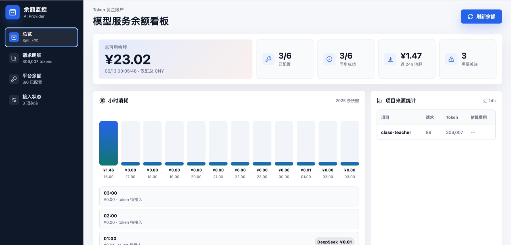
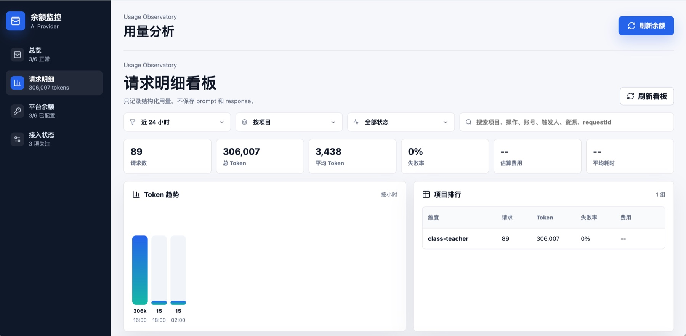
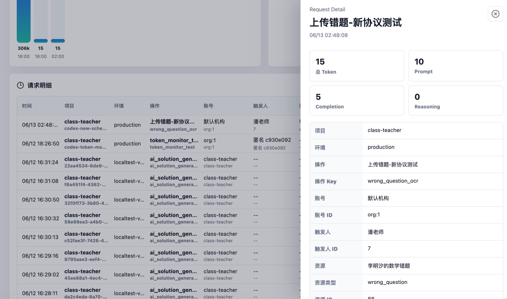

<p align="center">
  
</p>

<h1 align="center">Token 余额监控</h1>

<p align="center">
  把阿里云百炼、DeepSeek、豆包、Kimi、硅基流动、OpenRouter 的余额放到一个地方看。
  支持 Web 看板、Agent Skill、macOS 状态栏桌宠、iPhone App 和小组件。
</p>

<p align="center">
  <strong>Token Balance Monitor</strong> is a self-hosted open-source monitor for AI provider balances
  and request-level token usage across Web, macOS, iPhone widgets, and agent workflows.
</p>

<p align="center">
  <a href="LICENSE"></a>
  
  
  
</p>

<p align="center">
  <a href="#5-分钟跑起来">Quick Start</a> ·
  <a href="#agent-skill">Agent Skill</a> ·
  <a href="docs/api-reference.md">API Reference</a> ·
  <a href="#支持平台">Providers</a> ·
  <a href="#安全模型">Privacy & Security</a>
</p>

## Overview

模型平台用多了以后，余额会散在不同控制台里：阿里云百炼一处、DeepSeek 一处、豆包/Kimi/OpenRouter 又是另一处。Token 余额监控把这些账户余额收在一个自托管服务里，并提供几个不同入口：

- **统一看余额**：阿里云、DeepSeek、豆包、Kimi、硅基流动、OpenRouter 放到同一个看板。
- **随手看状态**：macOS 状态栏、桌宠、iPhone App、小组件都可以显示重点关注平台。
- **追踪请求级 token**：业务项目可以上报每次模型调用的 token，用 Web 看板看到是谁、哪个功能、哪个资源在消耗。

云厂商 AccessKey 只保存在你自己的服务端 `.env`，不会打包进浏览器、macOS 客户端或 iPhone App。

## 适合谁 / Who it is for

- **多平台 AI 开发者**：同时使用阿里云百炼、DeepSeek、豆包、Kimi、硅基流动、OpenRouter，希望不用每天打开多个控制台查余额。
- **Agent / 后端项目维护者**：想知道每次模型调用来自哪个项目、功能、账号或业务对象，而不把 prompt 和 response 存进看板。
- **自托管优先的团队**：希望云厂商密钥留在自己的服务端，只把只读 token 或上报 token 发给客户端、Widget 或业务系统。

For English readers: this project is a local-first, self-hosted balance and token-usage monitor for teams that call multiple LLM providers and want operational visibility without sending provider keys or prompt content to a third-party dashboard.

## 选你需要的形态

每个入口都是独立的，按需要选一个用就行。

| 形态 | 用途 | 入口 |
| --- | --- | --- |
| **Web 看板** | 查看余额、近 24h 消耗、请求级 token 明细 | `./start.command` |
| **Agent Skill** | 让 Codex/Agent 查询余额、上报 usage | [skills/token-balance-monitor](skills/token-balance-monitor) |
| **macOS 状态栏 / 桌宠** | 在电脑右上角随手看余额 | `./pet.command` |
| **iPhone App / Widget** | 在手机和小组件里看余额，低于阈值提醒 | [ios/TokenBalanceMonitor](ios/TokenBalanceMonitor) |
| **Scriptable 小组件** | 不装原生 App，只要一个轻量 iPhone 小组件 | [docs/ios-scriptable-widget.js](docs/ios-scriptable-widget.js) |

## 预览

<p align="center">
  
</p>

| 请求级 Token 看板 | 请求详情 |
| --- | --- |
|  |  |

| macOS 桌宠 | iPhone App / Widget |
| --- | --- |
|  |  |

## 5 分钟跑起来

### 1. 安装

```bash
git clone https://github.com/pan609/token-balance-monitor.git
cd token-balance-monitor

cp .env.example .env
./scripts/install-deps.sh
```

没有全局 `npm` 也没关系，项目脚本会优先使用本地和 Codex bundled Node runtime。

### 2. 填 key

打开 `.env`，按需填写你使用的平台。只想先看界面也可以留空，页面会显示“待配置”。

```bash
PRIMARY_PROVIDER_ID=aliyun
LOW_BALANCE_THRESHOLD_CNY=20

ALIYUN_ACCESS_KEY_ID=
ALIYUN_ACCESS_KEY_SECRET=

DEEPSEEK_API_KEY=
VOLCENGINE_ACCESS_KEY_ID=
VOLCENGINE_SECRET_ACCESS_KEY=
MOONSHOT_API_KEY=
SILICONFLOW_API_KEY=
OPENROUTER_API_KEY=
```

完整配置见 [.env.example](.env.example)。

### 3. 打开你要的入口

```bash
# Web 看板
./start.command

# macOS 桌宠 / 状态栏
./pet.command
```

iOS:

```bash
# 模拟器
./scripts/run-ios-simulator.sh

# 真机
./scripts/run-ios-device.sh
```

## Agent Skill

Agent 场景只依赖自托管服务，不需要安装 macOS 或 iOS 客户端。

安装 Skill：

```bash
mkdir -p ~/.codex/skills
cp -R skills/token-balance-monitor ~/.codex/skills/
```

给 Agent 配置：

```bash
TOKEN_MONITOR_BASE_URL=https://balance.example.com/token-monitor
TOKEN_MONITOR_MOBILE_TOKEN=只读查询token
TOKEN_MONITOR_INGEST_TOKEN=usage上报token
```

可用能力：

```bash
# 查询余额
node ~/.codex/skills/token-balance-monitor/scripts/token-monitor.mjs balance

# 输出请求明细看板地址
node ~/.codex/skills/token-balance-monitor/scripts/token-monitor.mjs dashboard

# 上报请求级 token
node ~/.codex/skills/token-balance-monitor/scripts/token-monitor.mjs report ./usage-event.json
```

详细字段和行为建议见 [Agent 接入文档](docs/agent-integration.md)；稳定接口契约见 [API Reference](docs/api-reference.md)。

## 请求级 Token 看板

余额只能回答“还剩多少钱”。如果你想知道“哪次请求花了多少 token、来自哪个项目、哪个用户、哪个业务对象”，在业务项目里接入 usage 上报。

推荐模式是 `report-only`：

```text
业务项目 -> 模型平台
业务项目 -> Token Monitor /api/usage/events
```

最小事件示例：

```json
{
  "projectId": "my-product",
  "environment": "production",
  "provider": "aliyun",
  "model": "qwen-plus",
  "feature": "chat_completion",
  "operationName": "智能问答",
  "accountId": "workspace:1",
  "actorId": "user:123",
  "requestId": "req_abc",
  "status": "success",
  "promptTokens": 1200,
  "completionTokens": 340,
  "totalTokens": 1540
}
```

内置 JS SDK 在 [sdk/javascript](sdk/javascript)。完整事件模型、旧字段兼容和接入示例见 [Agent 接入文档](docs/agent-integration.md)，接口鉴权、请求体和响应格式见 [API Reference](docs/api-reference.md)。

## 支持平台

| 平台 | 接入方式 | 余额汇总 |
| --- | --- | --- |
| 阿里云百炼 / 费用中心 | RAM AccessKey + 费用中心 API | CNY |
| DeepSeek | API Key + `/user/balance` | 按返回币种显示 |
| 火山引擎 / 豆包 | AccessKey + 费用中心 API | CNY |
| Kimi / Moonshot | API Key + 余额 API | CNY |
| SiliconFlow / 硅基流动 | API Key + 用户信息 API | CNY |
| OpenRouter | Management key + credits API | USD 单独显示 |

`totalCny` 只汇总人民币余额。OpenRouter 这类 USD credits 会单独显示，不混入人民币总额。

OpenAI / Anthropic / Gemini 更适合做“本月成本 / 用量报表”，不是简单余额接口。当前适配状态见 [provider matrix](docs/provider-matrix.md)。

## 刷新和提醒

- 服务端默认每 1 分钟刷新余额并记录历史快照。
- Web 看板根据余额快照估算近 24h 消耗。
- macOS 状态栏默认每 1 分钟刷新。
- iPhone App 前台打开时每 1 分钟刷新。
- WidgetKit 小组件通常不会严格每分钟刷新，最终频率由 iOS 调度。
- iPhone 低余额提醒阈值由 `MOBILE_ALERT_THRESHOLD_CNY` 控制，默认 2 元。

## 服务器部署

有服务器时，推荐把 Node 服务部署在服务器内网端口，再用 Nginx/Caddy 提供 HTTPS。iPhone App、Widget、Agent Skill 都访问你的自托管服务。

最小启动：

```bash
git clone https://github.com/pan609/token-balance-monitor.git /opt/token-balance-monitor
cd /opt/token-balance-monitor
cp .env.example .env
npm ci
npm run build
NODE_ENV=production node server/index.mjs
```

生产环境至少设置：

```bash
NODE_ENV=production
HOST=127.0.0.1
PORT=5173
MOBILE_API_TOKEN=replace-with-long-random-token
USAGE_INGEST_TOKEN=replace-with-another-long-random-token
PRIMARY_PROVIDER_ID=aliyun
```

完整 systemd、Nginx、HTTPS、iPhone 连接示例见 [部署文档](docs/deployment.md)。

## 重点关注平台

`PRIMARY_PROVIDER_ID` 控制 Web、macOS、iOS、小组件默认显示的重点平台。

可选值：

```text
aliyun
moonshot
deepseek
siliconflow
volcengine
openrouter
```

命令行切换：

```bash
./scripts/set-primary-provider.sh deepseek
./scripts/set-primary-provider.sh 豆包
```

如果是自托管服务器，可以用脚本同步更新远端配置：

```bash
TOKEN_MONITOR_REMOTE_HOST=user@example.com \
TOKEN_MONITOR_REMOTE_DIR=/home/user/token-monitor \
./scripts/set-primary-provider.sh deepseek --both
```

## 安全模型

- `.env` 已加入 `.gitignore`，不要提交真实 key。
- AccessKey 和 API Key 只在 Express 服务端读取。
- Web 前端、macOS 桌宠、iOS App、小组件都不持有云厂商密钥。
- 公网部署必须设置强随机 `MOBILE_API_TOKEN` 和 `USAGE_INGEST_TOKEN`。
- 如果曾经把服务器密码或真实 key 贴到聊天、issue、日志里，建议立即轮换。

更多安全建议见 [SECURITY.md](SECURITY.md)。

## 项目结构

```text
server/                  余额 provider、历史快照、usage events API
src/                     Web 看板
pet/                     macOS 桌宠 UI
electron/                macOS 状态栏和桌宠外壳
ios/TokenBalanceMonitor  iPhone App 和 WidgetKit
skills/token-balance-monitor
                         给 Agent / Codex 使用的 Skill
sdk/javascript           请求级 token 上报 SDK
docs/                    部署、接入、平台说明
```

接口文档见 [API Reference](docs/api-reference.md)。它只把 `GET /api/mobile/summary`、`POST /api/usage/events` 等稳定集成面作为主要入口；Web Dashboard 内部读取接口单独标注。

## 新增平台

如果平台有官方余额 API，新增成本很低：

1. 新增 `server/providers/<name>.mjs`，读取 `.env` 中的 key，请求官方接口。
2. fetcher 返回统一结构：`status`、`amount`、`currency`、`message`、`metrics`。
3. 在 `server/providers/index.mjs` 注册平台信息和 fetcher。
4. 在 `.env.example` 和 [API sources](docs/api-sources.md) 补配置与官方文档链接。
5. 如果要让 iPhone 小组件可选它，在 `BalanceWidgetConfigurationIntent.swift` 增加一个枚举值。

## 开发

```bash
./scripts/build.sh
npm run check
```

改 iOS 后建议至少跑一次：

```bash
xcodebuild \
  -project ios/TokenBalanceMonitor/TokenBalanceMonitor.xcodeproj \
  -scheme TokenBalanceMonitor \
  -destination 'generic/platform=iOS Simulator' \
  -derivedDataPath ios/TokenBalanceMonitor/DerivedDataCheck \
  CODE_SIGNING_ALLOWED=NO \
  build
```

贡献前请看 [CONTRIBUTING.md](CONTRIBUTING.md) 和 [open source checklist](docs/open-source-checklist.md)。

## License

[MIT](LICENSE)
